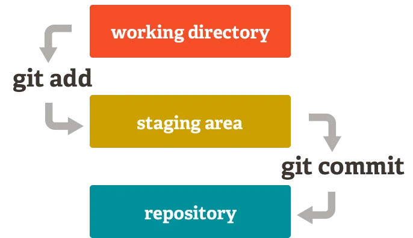

# Project: 2024-01-17

> Today's activities are straightforward, with a focus on ensuring that the entire class has Git, Visual Studio Code (Vscode), Node.js, and either Firefox or Chrome installed.

### Topics 

- Git and GitHub
- Markdown
- Introduction to Visual Studio Code (VsCode)

### Tentative Timeline

- Mini lecture (~35min)
- Group / Pair programming `+ Break` (~50min)
- Mini lecture (~35min)
- Group / Pair programming (~35min)

---

### Unified Setup
- [Works on My Machine](https://dzone.com/articles/works-on-my-machine)
- Solution:
  - Docker for Containerization
  - [WSL](https://learn.microsoft.com/en-us/windows/wsl/setup/environment)
- [Poor man solution](https://github.com/tx00-web-en/Activities/tree/week1/0-intro/unified-setup)

### Git and Markdown

- Git
  - [used for Linux](https://github.com/torvalds/linux)
  - Versioning, collaboration, 
  - [Working Tree, Staging Area, and Local Repo]
  - [Staging vs. Committing]
  - Git how-to: [www](https://githowto.com), [src](https://github.com/GitHowTo/githowto-content)
  - More on Git later (e.g Branching, [visualizing-git])
- [Markdown](https://www.markdownguide.org/cheat-sheet/)

### Activity 1

- Install Git
- Create a local Git repository.
- Configure Git locally.
- Execute Git commands (`init`, `add`, `commit`).
- Work with Markdown.
- [Instructions](./activity-git/git-basics-1.md)

---

### VsCode: Key Features

- Multi-Language Support
- Integrated Terminal
- Extensions and Marketplace
  - [Live Share](https://code.visualstudio.com/learn/collaboration/live-share)
- Version Control Integration
- Customization and Themes
- Cross-Platform Compatibility
- Lightweight and Speedy
- Ease of Use
- Extensibility via extensions 

### Activity 2: 

- Install `Vscode`, `Node.js`, `Firefox` or `Chrome`.
- Authenticate to GitHub with Vscode.
- Push your code to GitHub.
- Execute basic Node.js scripts.
- [Instructions](./activity-git/git-basics-2.md)

---

### Resources
- [Git local commands](./activity-git/git-local-cmds.md)
- [Git remote commands](./activity-git/git-remote-cmds.md)
- Reading
  - [vscode]
  - Git: [githowto.com], [Learn Git], [Understanding Staging Area]
- [Unified Setup]

---

<!-- Links -->
[Unified Setup]:https://github.com/tx00-web-en/Activities/tree/week1/0-intro/unified-setup
[vscode]:../Reading/vscode.md
[githowto.com]:https://githowto.com
[Learn Git]:https://www.atlassian.com/git
[Staging vs. Committing]:https://practicalgit.com/blog/staging-vs-commit.html
[visualizing-git]:https://git-school.github.io/visualizing-git/
[Understanding Staging Area]:https://tecadmin.net/git-staging-area-explained/
[Working Tree, Staging Area, and Local Repo]:https://medium.com/@lucasmaurer/git-gud-the-working-tree-staging-area-and-local-repo-a1f0f4822018